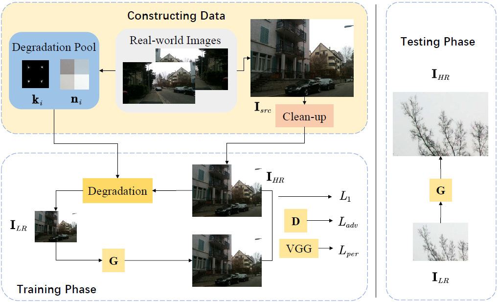
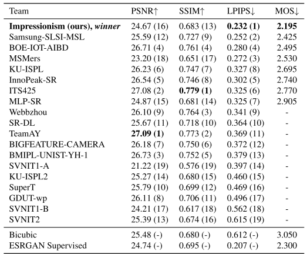
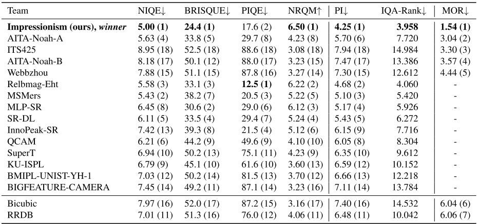
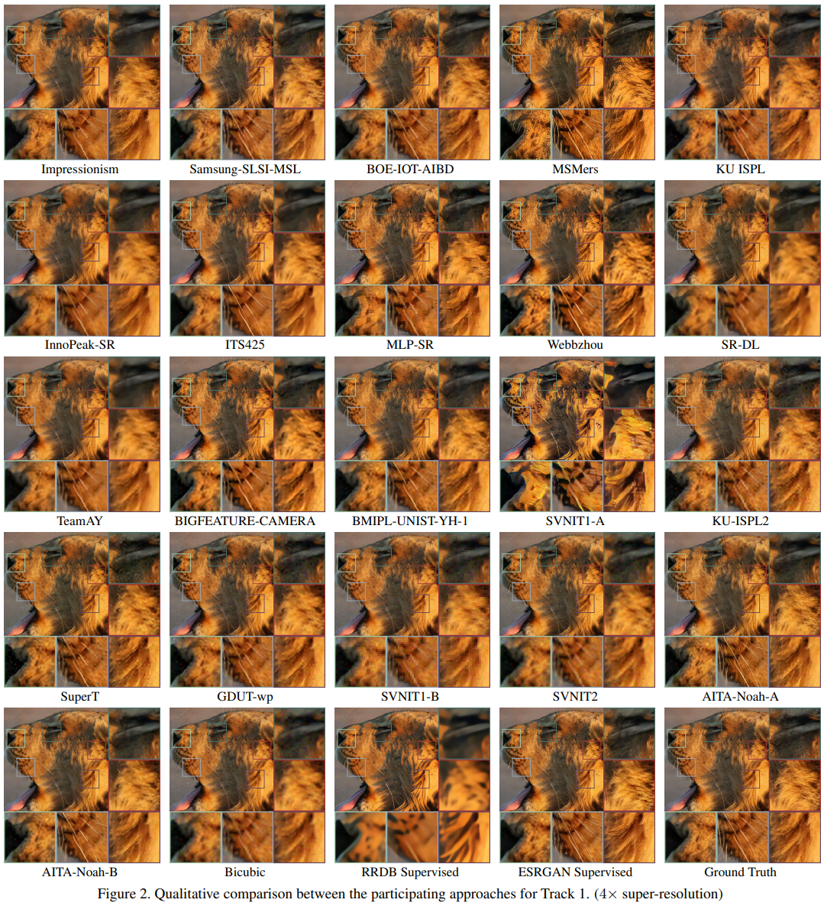
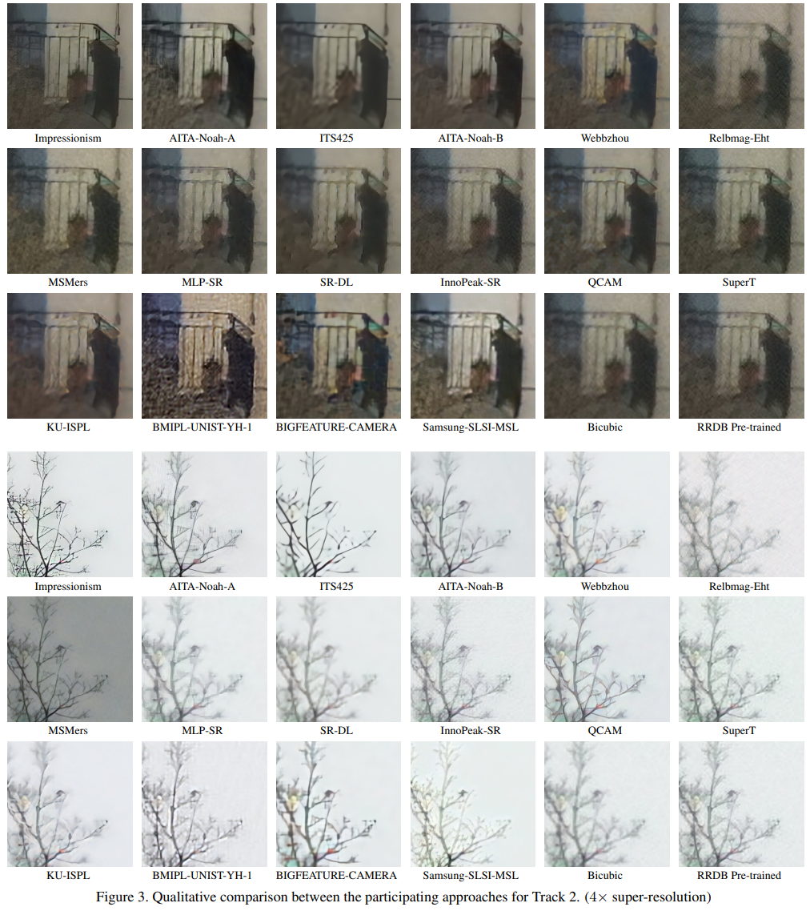

# RealSR 

Real-World Super-Resolution via Kernel Estimation and Noise Injection (CVPRW 2020)

Xiaozhong Ji, Yun Cao, Ying Tai, Chengjie Wang, Jilin Li, and Feiyue Huang

*Tencent YouTu Lab*

Our solution is the **winner of CVPR NTIRE 2020 Challenge on Real-World Super-Resolution** in both tracks.

(*Official PyTorch Implementation*)

## Introduction

Recent state-of-the-art super-resolution methods have achieved impressive performance on ideal datasets regardless of blur and noise. However, these methods always fail in real-world image super-resolution, since most of them adopt simple bicubic downsampling from high-quality images to construct Low-Resolution (LR) and High-Resolution (HR) pairs for training which may lose track of frequency-related details. To address this issue, we focus on designing a novel degradation framework for real-world images by estimating various blur kernels as well as real noise distributions. Based on our novel degradation framework, we can acquire LR images sharing a common domain with real-world images. Then, we propose a real-world super-resolution model aiming at better perception. Extensive experiments on synthetic noise data and real-world images demonstrate that our method outperforms the state-of-the-art methods, resulting in lower noise and better visual quality. In addition, our method is the winner of NTIRE 2020 Challenge on both tracks of Real-World Super-Resolution, which significantly outperforms other competitors by large margins. 

  

If you are interested in this work, please cite our paper

    @article{Ji2020realsr,
        title={Real World Super-Resolution via Kernel Estimation and Noise Injection},
        author={Xiaozhong Ji, Yun Cao, Ying Tai, Chengjie Wang, Jilin Li, and Feiyue Huang},
        journal={CVPR Workshops},
        year={2020},
    }

and challenge report [NTIRE 2020 Challenge on Real-World Image Super-Resolution: Methods and Results](https://arxiv.org/pdf/2005.01996.pdf)

    @article{Lugmayr2020ntire,
            title={NTIRE 2020 Challenge on Real-World Image Super-Resolution: Methods and Results},
            author={Andreas Lugmayr, Martin Danelljan, Radu Timofte, Namhyuk Ahn, Dongwoon Bai, Jie Cai, Yun Cao, Junyang Chen, Kaihua Cheng, SeYoung Chun, Wei Deng, Mostafa El-Khamy Chiu, Man Ho, Xiaozhong Ji, Amin Kheradmand, Gwantae Kim, Hanseok Ko, Kanghyu Lee, Jungwon Lee, Hao Li, Ziluan Liu, Zhi-Song Liu, Shuai Liu, Yunhua Lu, Zibo Meng, Pablo Navarrete, Michelini Christian, Micheloni Kalpesh, Prajapati Haoyu, Ren Yong, Hyeok Seo, Wan-Chi Siu, Kyung-Ah Sohn, Ying Tai, Rao Muhammad Umer, Shuangquan Wang, Huibing Wang, Timothy Haoning Wu, Haoning Wu, Biao Yang, Fuzhi Yang, Jaejun Yoo, Tongtong Zhao, Yuanbo Zhou, Haijie Zhuo, Ziyao Zong, Xueyi Zou},
            journal={CVPR Workshops},
            year={2020},
        }

    

 
## Visual Results


# Quantitative Results Compared with Other Participating Methods

'Impressionism' is our team. Note that the final decision is based on MOS (Mean Opinion Score) and MOR (Mean Opinion Rank).





# Qualitative Results Compared with Other Participating Methods

'Impressionism' is our team. 






## Dependencies and Installation
This code is based on [BasicSR](https://github.com/xinntao/BasicSR).

- Python 3 (Recommend to use [Anaconda](https://www.anaconda.com/download/#linux))
- [PyTorch >= 1.0](https://pytorch.org/)
- NVIDIA GPU + [CUDA](https://developer.nvidia.com/cuda-downloads)
- Python packages: `pip install numpy opencv-python lmdb pyyaml`
- TensorBoard: 
  - PyTorch >= 1.1: `pip install tb-nightly future`
  - PyTorch == 1.0: `pip install tensorboardX`


## Pre-trained models
- [DF2K](https://drive.google.com/open?id=1pWGfSw-UxOkrtbh14GeLQgYnMLdLguOF) for corrupted images with processing noise.
- [DPED](https://drive.google.com/open?id=1zZIuQSepFlupV103AatoP-JSJpwJFS19) for real images taken by cell phone camera.
- [DF2K-JPEG](https://drive.google.com/open?id=1w8QbCLM6g-MMVlIhRERtSXrP-Dh7cPhm) for compressed jpeg image.
 
## Testing
Download dataset from [NTIRE 2020 RWSR](https://competitions.codalab.org/competitions/22220#participate) and unzip it to your path.

For convenient, we provide [Corrupted-te-x](https://drive.google.com/open?id=1GrLxeE-LruddQoAePV1Z7MFclXdZWHMa) and [DPEDiphone-crop-te-x](https://drive.google.com/open?id=19zlofWRxkhsjf_TuRA2oI9jgozifGvxp).

```cd ./codes```

### DF2K: Image processing artifacts
 1. Modify the configuration file options/df2k/test_df2k.yml
     - line 1 : 'name' -- dir name for saving the testing results
     - line 13 : 'dataroot_LR' -- test images dir
     - line 26 : 'pretrain_model_G' -- pre-trained model for testing
 2. Run command :
 ```CUDA_VISIBLE_DEVICES=X python3 test.py -opt options/df2k/test_df2k.yml ```
 3. The output images is saved in '../results/'
 
### DPED: Smartphone images 
 1. Modify the configuration file options/dped/test_dped.yml
    - line 1 : 'name' -- dir name for saving the testing results
    - line 13 : 'dataroot_LR' -- test images dir
    - line 26 : 'pretrain_model_G' -- pre-trained model for testing
 2. Run command :
 ```CUDA_VISIBLE_DEVICES=X python3 test.py -opt options/dped/test_dped.yml```
 3. The output images is saved in '../results/'
 

## Training code

Release soon.
 